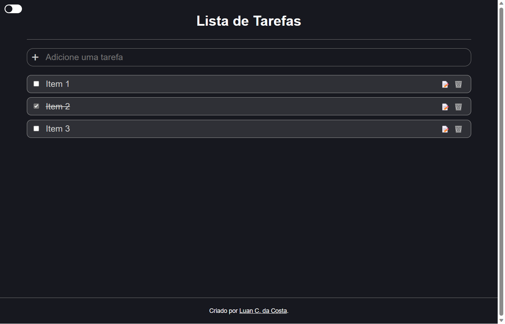

<h1 style="text-align: center;">react-todo-plus</h1>
<p>Storage your tasks😃!</p>

## Indice
- [preview](#😁-preview)
- [about](#📃-about)
- [tools](#🔨-tools)
- [how to contribute](#♻️-how-to-contribute)

## 😁 Preview


## 📃 About

**react-todo-plus** is a todo list with a CRUD and dark mode functionality.

## 🔨 Tools
- [React](https://legacy.reactjs.org/)
- [Typescript](https://www.typescriptlang.org/)
- [Vite](https://vitejs.dev/)
- [Styled-Components](https://styled-components.com/)

## ♻️ How to contribute

```bash
    # Clone the project
    $ git clone https://github.com/Luan-Costa-2l/react-todo-plus
```

```bash
    # Open the directory
    $ cd react-todo-plus
```

```bash
    # Install the dependecies
    $ npm install
```

```bash
    # Run the project
    $ npm run dev
```